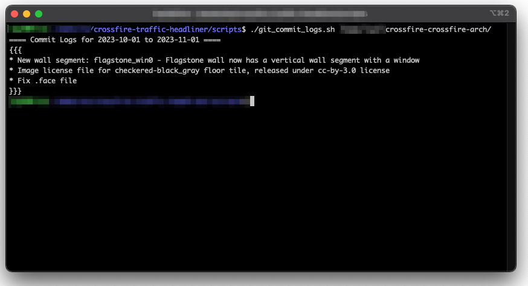
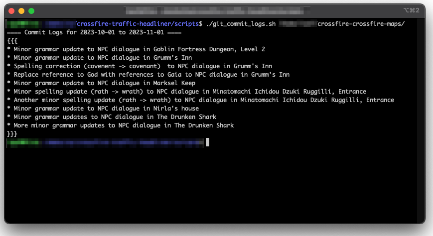
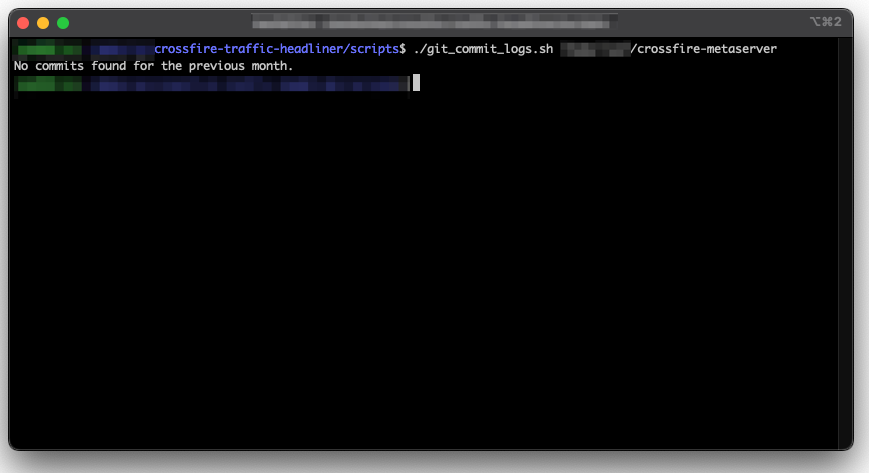

# Crossfire Traffic Headliner

## Description

`Crossfire Traffic Headliner` is a bash script that uses a git log to retrieve commit logs within the specified date range, formats them as an unordered list in DokuWiki-compatible syntax, and prints the result to the console. If there are no commits for the previous month, it will notify you.

## Installation

It is helpful to have `git` installed to download all the related code for `Crossfire Traffic Headliner`.

### Requirements

The script requires `awk` and `git` to be installed.

## Guidelines

## Usage

Make the script (`git_commit_logs.sh`) executable (`chmod +x git_commit_logs.sh`), and then run it with the path to your Git repository as an argument:

```bash

./git_commit_logs.sh /path/to/your/git/repo

```

## Background

 * What is the script for?
   * The scripts is used to update the Crossfire DokuWiki page that tracks all the changes with the game that are noticeable for people playing the game; not a ChangeLog of all code changes.
 * What was your motivation?
   * My motivation for creating this script was rooted in my involvement with a gaming project centered around [Crossfire](https://sourceforge.net/projects/crossfire/). Every month I update the Traffic page with game changes, and sometimes this can be a lengthy task. So I looked for a way to automate this as much as possible.
 * What problem does it solve?
   * Save time and to be efficient with collecting the commit log summaries. However, human review and interaction is required to remove commit logs that are not pertinent to in-game content or encounters.

## Screenshot

 1. Log output sample for Crossfire Archetypes.
 
 2. Log output sample for Crossfire Maps.
 
 3. Log output sample showing no recent upates.
 


## Live Web Page

Traffic Page at the [Crossfire Wiki](http://wiki.cross-fire.org/dokuwiki/doku.php/crossfire_traffic)

## Contributing

 * Contributions are welcome.
 * Pull requests are welcome.
 * Creating a fork on this code base is also welcome.

## Questions

I can be reached via [tannerrj GitHub Profile](https://github.com/tannerrj)

## License:

MIT License

## Crossfire Social Media Links

 * [Facebook](https://www.facebook.com/crossfireproject/)
 * [Mastodon](https://mastodon.social/@crossfiremrpg)
 * [X (Formerly Twitter)](https://twitter.com/crossfiremrpg/)